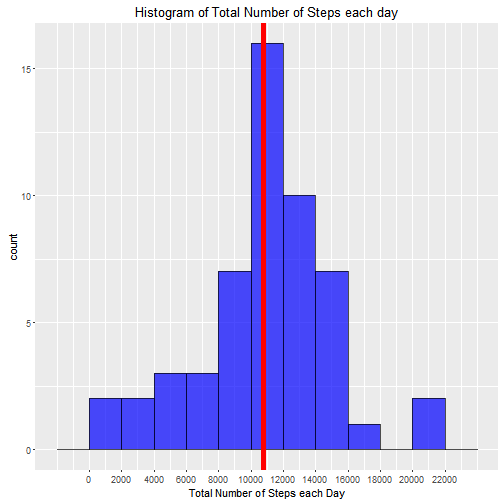
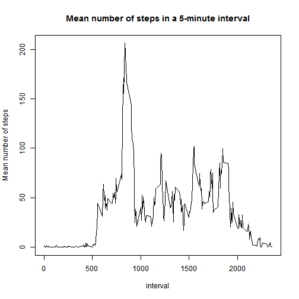
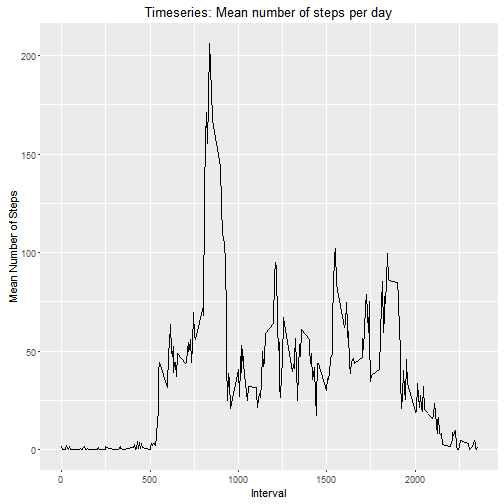
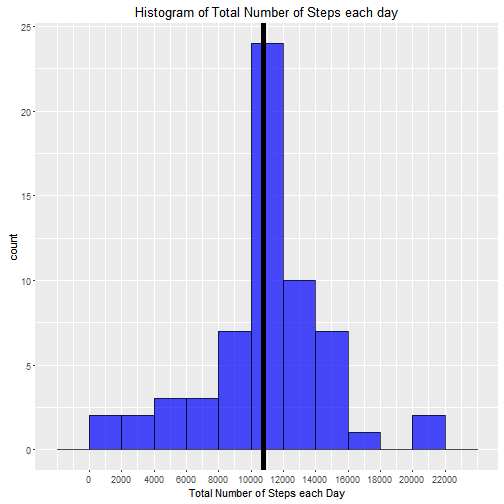
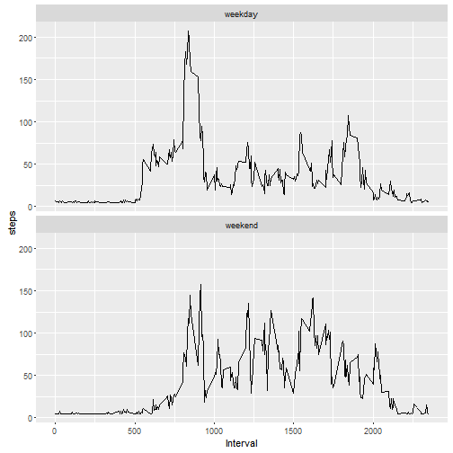

## Week 1 Assignment: Reproducible Research

####Introduction
 
It is now possible to collect a large amount of data about personal movement using activity monitoring devices such as a Fitbit, Nike Fuelband, or Jawbone Up. These type of devices are part of the "quantified self" movement - a group of enthusiasts who take measurements about themselves regularly to improve their health, to find patterns in their behavior, or because they are tech geeks. 
But these data remain under-utilized both because the raw data are hard 
to obtain and there is a lack of statistical methods and software for 
processing and interpreting the data.

This assignment makes use of data from a personal activity monitoring device. 
This device collects data at 5 minute intervals through out the day. 
The data consists of two months of data from an anonymous individual collected during the months of October and November, 2012 and include the number of steps  taken in 5 minute intervals each day.

The data for this assignment can be downloaded from the course web site:
[link](https://d396qusza40orc.cloudfront.net/repdata%2Fdata%2Factivity.zip)

#### Code for setting directory on desktop, downloading, unzipping and reading the dataset


####Average and Total number of steps each day

```r
# What is mean total number of steps taken per day?
with(dat,tapply(steps, date, mean, na.rm=T))
```

```
## 2012-10-01 2012-10-02 2012-10-03 2012-10-04 2012-10-05 2012-10-06 
##        NaN  0.4375000 39.4166667 42.0694444 46.1597222 53.5416667 
## 2012-10-07 2012-10-08 2012-10-09 2012-10-10 2012-10-11 2012-10-12 
## 38.2465278        NaN 44.4826389 34.3750000 35.7777778 60.3541667 
## 2012-10-13 2012-10-14 2012-10-15 2012-10-16 2012-10-17 2012-10-18 
## 43.1458333 52.4236111 35.2048611 52.3750000 46.7083333 34.9166667 
## 2012-10-19 2012-10-20 2012-10-21 2012-10-22 2012-10-23 2012-10-24 
## 41.0729167 36.0937500 30.6284722 46.7361111 30.9652778 29.0104167 
## 2012-10-25 2012-10-26 2012-10-27 2012-10-28 2012-10-29 2012-10-30 
##  8.6527778 23.5347222 35.1354167 39.7847222 17.4236111 34.0937500 
## 2012-10-31 2012-11-01 2012-11-02 2012-11-03 2012-11-04 2012-11-05 
## 53.5208333        NaN 36.8055556 36.7048611        NaN 36.2465278 
## 2012-11-06 2012-11-07 2012-11-08 2012-11-09 2012-11-10 2012-11-11 
## 28.9375000 44.7326389 11.1770833        NaN        NaN 43.7777778 
## 2012-11-12 2012-11-13 2012-11-14 2012-11-15 2012-11-16 2012-11-17 
## 37.3784722 25.4722222        NaN  0.1423611 18.8923611 49.7881944 
## 2012-11-18 2012-11-19 2012-11-20 2012-11-21 2012-11-22 2012-11-23 
## 52.4652778 30.6979167 15.5277778 44.3993056 70.9270833 73.5902778 
## 2012-11-24 2012-11-25 2012-11-26 2012-11-27 2012-11-28 2012-11-29 
## 50.2708333 41.0902778 38.7569444 47.3819444 35.3576389 24.4687500 
## 2012-11-30 
##        NaN
```

```r
# Alternative ways to calculate Total number of steps each day
# with(dat,tapply(steps, date, mean, na.rm=T))
dat.steps <- tapply(dat$steps, dat$date, FUN = sum, na.rm = TRUE)
# dat.steps

require(dplyr)

total.steps <- dat %>%
      filter(!is.na(steps)) %>%
      group_by(date) %>%
      summarize(steps = sum(steps)) %>%
      print
```

```
## Source: local data frame [53 x 2]
## 
##          date steps
##        (fctr) (int)
## 1  2012-10-02   126
## 2  2012-10-03 11352
## 3  2012-10-04 12116
## 4  2012-10-05 13294
## 5  2012-10-06 15420
## 6  2012-10-07 11015
## 7  2012-10-09 12811
## 8  2012-10-10  9900
## 9  2012-10-11 10304
## 10 2012-10-12 17382
## ..        ...   ...
```


### Histogram of the total number of steps taken each day

```r
# Histogram using ggplot2
require(ggplot2)
```

```r
qplot(total.steps$steps, geom = 'histogram', binwidth=2000, xlab = 'Total Number of Steps each Day',
      main = 'Histogram of Total Number of Steps each day', fill=I("blue"),
      col=I("black"),
      alpha=I(.7))+
      scale_x_continuous(breaks=seq(0,23000,2000))+
      geom_vline(xintercept =  mean(total.steps$steps),col='red',lwd=2)
```




### Mean and median number of steps taken each day


```r
#average steps in a day
mean.steps <- dat %>% 
      filter(!is.na(steps)) %>%
      group_by(date)  %>% 
      summarise(avg = mean(steps,na.rm=T))

#median steps in a day
median.steps <- dat %>% 
      filter(!is.na(steps)) %>%
      group_by(date)       %>% 
      summarise(med = median(steps,na.rm=T))

# alternative way in calculating the median
# with(dat,tapply(steps,date,mean))

# alternative way in calculating the median
# with(dat,tapply(steps,date,median))
```


### Time series plot of the average number of steps taken

```r
# What is the average daily activity pattern?

# Make a time series plot (i.e. type = "l") of the 5-minute interval (x-axis) and # the average number of steps taken, averaged across all days (y-axis)

mean.interval <- dat %>%
      filter(!is.na(steps)) %>%
      group_by(interval) %>%
      summarize(steps = mean(steps)) %>%
      print   
```

```
## Source: local data frame [288 x 2]
## 
##    interval     steps
##       (int)     (dbl)
## 1         0 1.7169811
## 2         5 0.3396226
## 3        10 0.1320755
## 4        15 0.1509434
## 5        20 0.0754717
## 6        25 2.0943396
## 7        30 0.5283019
## 8        35 0.8679245
## 9        40 0.0000000
## 10       45 1.4716981
## ..      ...       ...
```

```r
# plot using the base graph
plot(mean.interval, type='l', main= 'Mean number of steps in a 5-minute interval',
     ylab= 'Mean number of steps')
```



```r
# plotting using the ggplot2 library
ggplot( data = mean.interval, aes( interval, steps )) + geom_line()+
      labs(x='Interval', y='Mean Number of Steps',
           title='Timeseries: Mean number of steps per day')
```



```r
# Which 5-minute interval, on average across all the days in the dataset, #contains the maximum number of steps?

mean.interval$interval[which.max(mean.interval$steps)]
```

```
## [1] 835
```


### Imputing missing values


```r
# Note that there are a number of days/intervals where there are missing values #(coded as NA). The presence of missing days may introduce bias into some calculations or summaries of the data.

# Calculate and report the total number of missing values in the dataset 

# Number of missing values
Nmv <- sum(is.na(dat$steps))
Nmv
```

```
## [1] 2304
```

Devise a strategy for filling in all of the missing values in the dataset. The strategy does not need to be sophisticated. For example, you could use the mean/median for that day, or the mean for that 5-minute interval, etc.


```r
# Create a new dataset that is equal to the original dataset but with the missing data filled in.
dat.imputed  <- transform(dat, steps = ifelse(is.na(steps), round(mean(dat$steps, na.rm=TRUE)), steps))


# Make a histogram of the total number of steps taken each day and 

total.steps.imputed <- dat.imputed %>%
      group_by(date) %>%
      summarize(steps = sum(steps)) %>%
      print
```

```
## Source: local data frame [61 x 2]
## 
##          date steps
##        (fctr) (dbl)
## 1  2012-10-01 10656
## 2  2012-10-02   126
## 3  2012-10-03 11352
## 4  2012-10-04 12116
## 5  2012-10-05 13294
## 6  2012-10-06 15420
## 7  2012-10-07 11015
## 8  2012-10-08 10656
## 9  2012-10-09 12811
## 10 2012-10-10  9900
## ..        ...   ...
```

```r
qplot(total.steps.imputed$steps, geom = 'histogram', binwidth=2000, xlab = 'Total Number of Steps each Day',
      main = 'Histogram of Total Number of Steps each day', fill=I("blue"),
      col=I("black"),
      alpha=I(.7))+
      scale_x_continuous(breaks=seq(0,23000,2000))+
      geom_vline(xintercept = mean(total.steps.imputed$steps),col='black',lwd=2)
```




Calculate and report the mean and median total number of steps taken per day. 
Do these values differ from the estimates from the first part of the assignment? 
What is the impact of imputing missing data on the estimates of the total daily number of steps?


```r
# mean and median total number of steps taken per day on data with imputed values
mean(total.steps.imputed$steps)
```

```
## [1] 10751.74
```

```r
median(total.steps.imputed$steps)
```

```
## [1] 10656
```

```r
# mean and median total number of steps taken per day on data with missing values
mean(dat.steps)
```

```
## [1] 9354.23
```

```r
median(dat.steps)
```

```
## [1] 10395
```

```r
# do the means differ
diff.mean <- mean(dat.steps)-mean(total.steps.imputed$steps)
diff.mean
```

```
## [1] -1397.508
```

```r
# Do the data estimates differ from the first part of the assignment?
summary(dat.steps)
```

```
##    Min. 1st Qu.  Median    Mean 3rd Qu.    Max. 
##       0    6778   10400    9354   12810   21190
```

```r
summary(total.steps.imputed$steps)
```

```
##    Min. 1st Qu.  Median    Mean 3rd Qu.    Max. 
##      41    9819   10660   10750   12810   21190
```

```r
#What is the impact of imputing missing data on the estimates of the total daily number of steps?

summary(total.steps.imputed$steps)-summary(dat.steps)
```

```
##    Min. 1st Qu.  Median    Mean 3rd Qu.    Max. 
##      41    3041     260    1396       0       0
```

#### Are there differences in activity patterns between weekdays and weekends?
For this part the weekdays() function may be of some help here. 
Use the dataset with the filled-in missing values for this part. (dat.imputed)
Create a new factor variable in the dataset with two levels - "weekday" and "weekend" indicating whether a given date is a weekday or weekend day.


```r
dat.imputed$day 
```

```
## NULL
```

```r
for ( i in 1:nrow(dat.imputed)){
      
      if(weekdays(as.Date(dat.imputed$date[i])) %in% c('Sunday', 'Saturday')){
            dat.imputed$day[i] <- 'weekend'
      }else {
            dat.imputed$day[i] <- 'weekday'
      }
}

#making the new variable into a factor
dat.imputed$day <- as.factor(dat.imputed$day)

# Make a panel plot containing a time series plot (i.e. type = "l") of the 5-minute 
# interval (x-axis) and the average number of steps taken, averaged across all weekday days or weekend days (y-axis). 
# See the README file in the GitHub repository to see an example of what this plot should look like using simulated data.

# Frequency table: weekdays and weekends
table(dat.imputed$day)
```

```
## 
## weekday weekend 
##   12960    4608
```

```r
# Average steps in weekdays and weekends
with(dat.imputed, tapply(steps, day, mean))
```

```
##  weekday  weekend 
## 35.55957 42.31858
```

```r
dat.grouped <- dat.imputed %>% 
                  group_by(day, interval) %>%
                  summarise(day.steps = mean(steps))

ggplot(dat.grouped, aes(interval,day.steps))+
      geom_line()+ facet_wrap(~day,ncol = 1) +
      labs(x='Interval', y='steps')
```




